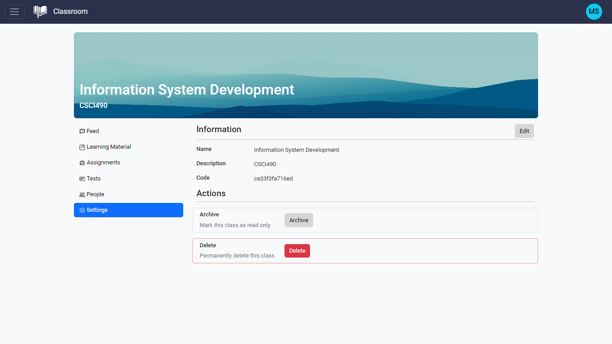
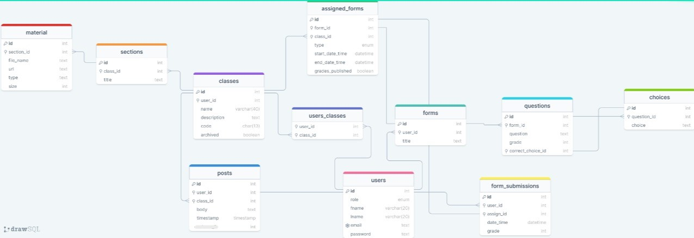

# Classroom

A web application that allows teachers and students to interact and collaborate in a virtual classroom
setting.

## Table of Contents

- [Overview](#overview)
- [Technologies](#technologies)
- [Features](#features)
  - [For teachers](#for-teachers)
  - [For students](#for-students)
- [Screenshots](#screenshots)
- [Database schema](#database-schema)
  - [users](#users)
  - [classes](#classes)
  - [users_classes](#users_classes)
  - [posts](#posts)
  - [sections](#sections)
  - [material](#material)
  - [forms](#forms)
  - [questions](#questions)
  - [choices](#choices)
  - [assigned_forms](#assigned_forms)
  - [form_submissions](#form_submissions)
- [History](#history)

## Overview

Classroom is a web application that simplifies the creation and management of virtual classrooms for teachers, and provides a central platform for students to access class materials, complete assignments, and participate in discussions. Teachers can create and manage their classes, create forms for assignments or tests, and upload study material. Students can view all the class material and complete their assignments in one place.

## Technologies

- ReactJS
- PHP (backend repository: [classroom-server](https://github.com/mohammadsemmo/classroom-server))
- MySQL
- React Bootstrap

## Features

### For teachers

- **Create and manage classes:** Teachers can create and manage their own virtual classrooms with Classroom. They can add a class name and description, and choose the subjects or topics they want to cover. They can also edit the class name or description at any time.

- **Archive classes:** Teachers can mark their classes as "read-only" or "archived" when they are no longer active. This means that students will no longer be able to submit assignments or participate in discussions, but they can still view the class material.

- **Create posts:** Teachers can create posts in their classes to communicate with their students or share updates. Posts are written in markdown to include text, images, or links to other resources.

- **Upload study material:** Teachers can upload study material, such as slides, notes, or videos, to their classes for their students to access.

- **Add people to the class:** Teachers can add students to their classes or send them a unique code. They can also add other teachers or assistants.

- **Create forms:** Teachers can create forms for assignments or tests in Classroom. Forms include questions, choices and the grade of each question.

- **Edit forms:** Teachers can edit their forms at any time, including the title, questions, choices.

- **Assign forms as tests or assignments:** Teachers can assign their forms as tests or assignments to their students in a certain class, and set a due date if necessary.

- **Delete forms:** Teachers can delete forms that they no longer need.

- **View grades:** Teachers can view the grades of their students for each assignment or test.

### For students

- **Join classes using a code:** Students can join a class by using a unique code provided by the teacher.

- **Create and view posts:** Students can create posts in their classes to ask questions or share their thoughts with their classmates and teachers. They can also view posts created by others in the class.

- **View study material:** Students can access and download all the study material provided by their teachers in one place, including slides, notes, and videos.

- **Solve assignments and tests:** Students can complete their assignments and tests in Classroom by filling out forms created by their teachers. They can submit their work before the due date and receive their grades.

- **View grades:** Students can view their grades for each assignment or test.

## Screenshots

## Database schema

The database for this project consists of the following tables:

### users

- id: int (primary key)
- role: enum ('admin', 'teacher', 'student')
- fname: varchar(20)
- lname: varchar(20)
- email: text
- password: text

### classes

- id: int (primary key)
- user_id: int (foreign key references users)
- name: varchar(20)
- description: text
- code: char(13)
- archived: boolean

### users_classes

- user_id: int (foreign key references users)
- class_id: int (foreign key references classes)

### posts

- id: int (primary key)
- user_id: int (foreign key references users)
- class_id: int (foreign key references classes)
- body: text
- timestamp: timestamp

### sections

- id: int (primary key)
- class_id: int (foreign key references classes)
- title: text

### material

- id: int (primary key)
- section_id: int (foreign key references sections)
- file_name: text
- url: text
- type: text
- size: bigint

### forms

- id: int (primary key)
- user_id: int (foreign key references users)
- title: text

### questions

- id: int (primary key)
- form_id: int (foreign key references forms)
- question: text
- correct_choice_id: int (foreign key references choices)
- grade: int

### choices

- id: int (primary key)
- question_id: int (foreign key references questions)
- choice: text

### assigned_forms

- id: int (primary key)
- form_id: int (foreign key references forms)
- class_id: int (foreign key references classes)
- type: enum('test', 'assignment')
- start_date_time: datetime
- end_date_time: datetime

### form_submissions

- id: int (primary key)
- user_id: int (foreign key references users)
- assign_id: int (foreign key references assigned_forms)
- date_time: timestamp
- grade: int

## History

Classroom was originally a [single page application built with vanilla JavaScript](https://github.com/mohammadsemmo/classroom-js) and PHP, using Bootstrap for the user interface.

The app was refactored and re-designed using ReactJS and React Bootstrap to improve the user experience and performance. The backend was also updated to use JSON Web Token for authentication and authorization and include more features.
